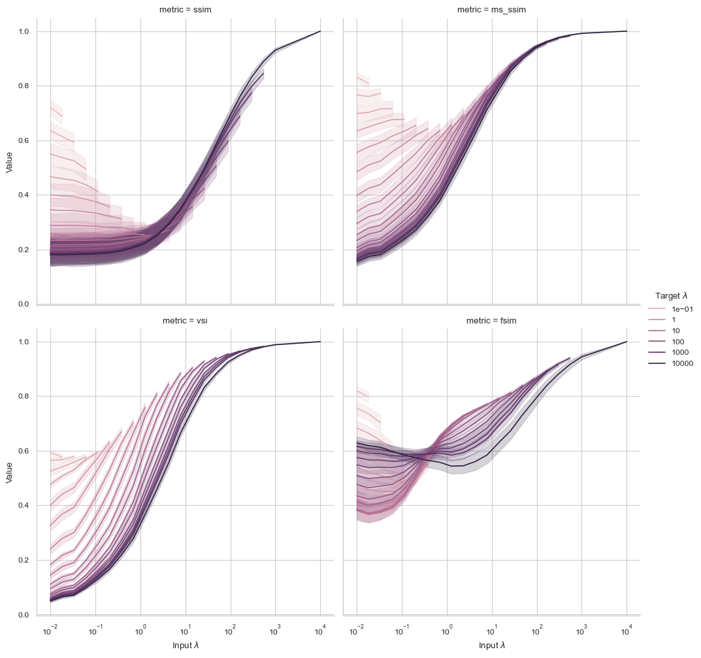

# Analysis of IQA metrics with Noisy References

The main goal of this workflow is to assess which metrics fare best when a clean target is not available for comparison. To this end, we generate some fake scientific images (ARPES-like) and apply different levels of Poisson noise to them.


The image quality metrics assessed are SSIM, MS-SSIM, VSI, and FSIM. The plot below shows the different metrics with both clean (the simulated one), and noisy reference images.  The hue shows the different reference noise levels (higher input_miv means less noisy), where the x-axis shows the input noise level.



Looking at first the clean reference (10000 MIV), SSIM, MS-SSIM and VSI all follow an expected behavior of reporting higher values when noise is lower, where FSIM interesting reports higher values at higher noise levels dropping till an input_miv of 0 and then steadily climbing up.

When comparing noisy inputs with less noisy targets, we see for target_mivs being below 1, the reported metric values are quite high. But other than FSIM, they all show behavior in line with clean target as we reduce target noise.

Looking at the error bars, VSI seems to produce the most consistent results across images. It also shows the highest dynamic range going from noisest to least noise images; a desirable quality.

VSI's high dynamic range, and consistent performance make it particularly appealing for scenarios where less noisy references must serve as proxies for clean targets. Its design, which accounts for perceptual relevance, might contribute to this stability.

Please take a look at [notebook](https://github.com/zain-sohail/noisy-iqa/blob/main/metric_comparison.ipynb) for the complete experiments.

## Run it yourself

1. Clone repository:
```
git clone https://github.com/yourusername/noisy-iqa.git
cd noisy_iqa
```

2. Create a virtual environment:
```
python3 -m venv .venv
source .venv/bin/activate
```

3. Install dependencies:

```
pip install -r requirements.txt
```

4. Run notebook

```
pip install ipykernel
python -m ipykernel install --user --name=iqa-kernel
```

Now you can open the [notebook](metric_comparison.ipynb) and use this kernel

## Future additions

1. Robustness of these metrics across varying noise types (e.g., Gaussian or mixed noise).
2. Investigate whether the range of metric values (from low to high noise) correlates well with the perceptual difference across the noise levels.
3. Compare with real data (This has been done for some metrics in [thesis](https://github.com/zain-sohail/master-thesis))
4. Look into additional metrics such as LPIPS (rudimentary analysis was done before with real data, showcasing quite perceptually uncorrelated results)
